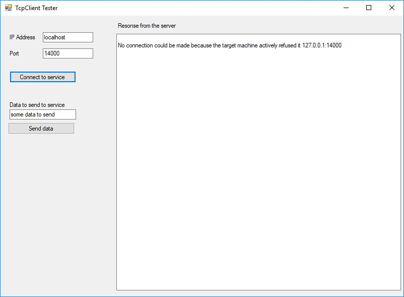

# TcpClientSendReceive
TcpClient comunication client that sends data on one thread and listening on another thread.  

This is basically a copy of [Matt Davis implementation on StackOverflow](https://stackoverflow.com/a/20698153/1187583) with lots of added stuff.

# Whats in it?
1. **ServerConsole** that listens for client communication.
2. **ClienConsole** program that sends data to the server and listens for responses.
3. **TcpClientLib** that contains all the connection logic.
4. **WinForms** project to manually connect and fire data to the server.

# How to run?
There are two ways you can run this.

1. Run up **ClienConsole** and **ServerConsole** and you will see data flow between each other.
2. Run up **WinForms** and **ServerConsole** and you'll see (its broken atm) the same but only after you manually send data.

# Known problems at the moment
1. All the data I'm sending to the service gets concatenated into one big (1024 byte) string. This is something I was going to research with the WinForms project.

2. If I run the WinForms client I can´t get the UI to update with data. That is probably because of some threading issues that should be possible to fix with some async stuff.

## Want to help me?
I would appreciate all the help/pointers you can offer!

## Here is an image of the beautiful WinForms Client 

